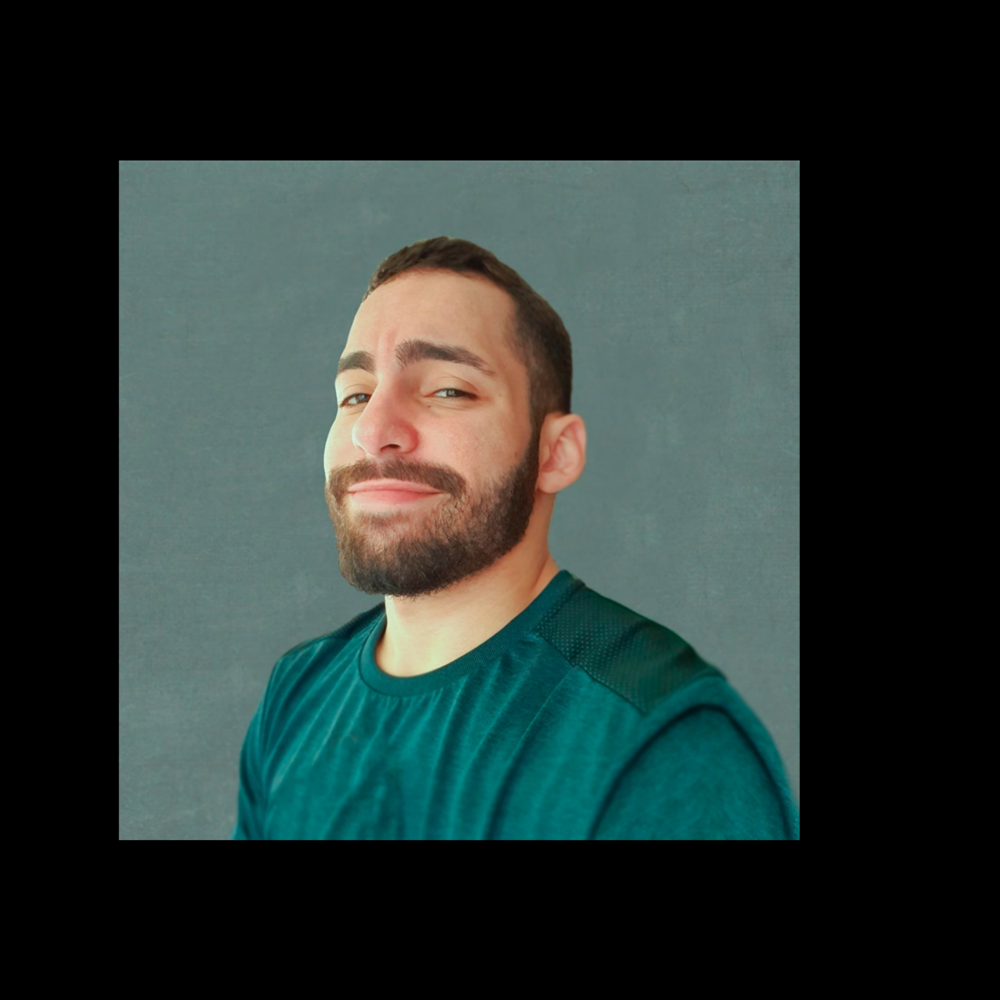

## **Olá, sou Rogério Camargo**
#
#

<h1 align="center"></h1>

Estudante de Banco de Dados, estagiária de TI e através deste portifólio evidencio meus projetos realizados durante meu curso na FATEC-SJC. Com o projeto da API pude desenvolver tanto minhas hards quanto softs skills, através dele tive uma noção do que estaria enfrentando no mercado de trabalho.

## Meus Projetos

### Em 2020-2
#

<h1 align="center"></h1>

### Descrição do projeto

Trabalhei no projeto da API com o Parceiro Acadêmico Professor Egydio, meu grupo era composto por 5 membros, denominado de "DeskwarePI".
O projeto visava construir um site para uma ONG de ensino infantil (ONG Vó Maria Felix), no qual conectassem integrantes da ONG, alunos e voluntários; visando facilitar o contato da instituição com os mesmos.
O site possui a página inicial com as notícias e calendários de evento, página de apresentação da ONG, página de doações, página de atividades para as crianças e a página de projetos. Além disso é possível:

- cadastrar participantes,
- voluntários específicos,
- voluntários de apoio e projetos.
- DeskwarePI

### Tecnologias Utilizadas

- **Reuniões e Apresentações:** Discord, WhatsApp e Microsoft Teams;

- **Banco de Dados:** MySQL e Wampserver;

- **Back-end:** PHP e JavaScript;

- **Front-end:** HTML, CSS e JavaScript;

- **Ferramentas:** Github, Visual Studio Code, Figma e Photoshop.

### Contribuições Pessoais

No projeto fiquei encarregada de escrever a documentação e participar da equipe do frontend, além disso fizemos um chatbot. Para a criação das telas primeiramente utilizamos o figma para o protótipo e com base nele fomos criando o site, encontramos algumas dificuldades, pois nem tudo do figma ficava bom no site funcional, adaptamos para que as telas ficassem responsivas e tivemos alguns bugs, por exemplo div sem fechamento, esquecer de colocar id no html, mas nenhum grande erro. Nossa maior dificuldade foi a criação do chatbot, não tinhamos o conhecimento necessário de javascript, e ficamos uma semana desenvolvendo essa parte do projeto.

### Hard Skills

Figma, JavaScript, CSS, Html

### Soft Skills

- Trabalho em equipe

- Pensamento criativo
